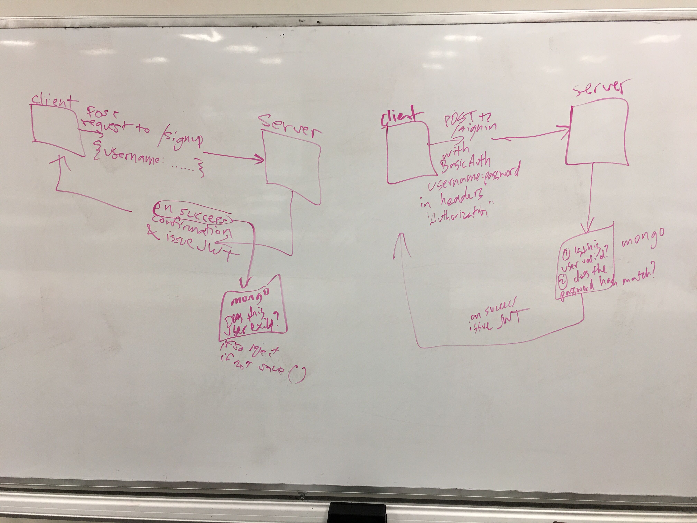

# auth-server
Authentication: Deploy an Express server that implements Basic Authentication, with signup and signin capabilities, using a Mongo database for storage.

- [class 11 lab readme](https://github.com/codefellows/seattle-javascript-401d34/blob/master/class-11/lab/README.md)
- [in class demo](https://github.com/codefellows/seattle-javascript-401d34/tree/master/class-12/in-class-demo)

### resources
- [JWT](https://jwt.io/introduction/)
- [mongoosejs docs methods statics](https://mongoosejs.com/docs/2.7.x/docs/methods-statics.html)

### UML
